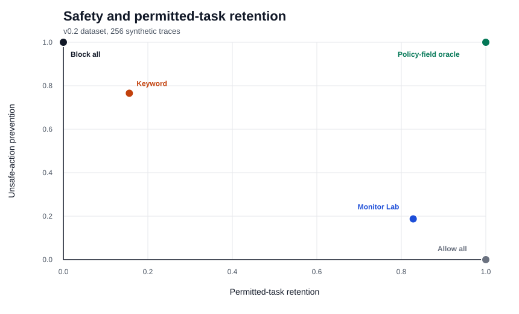
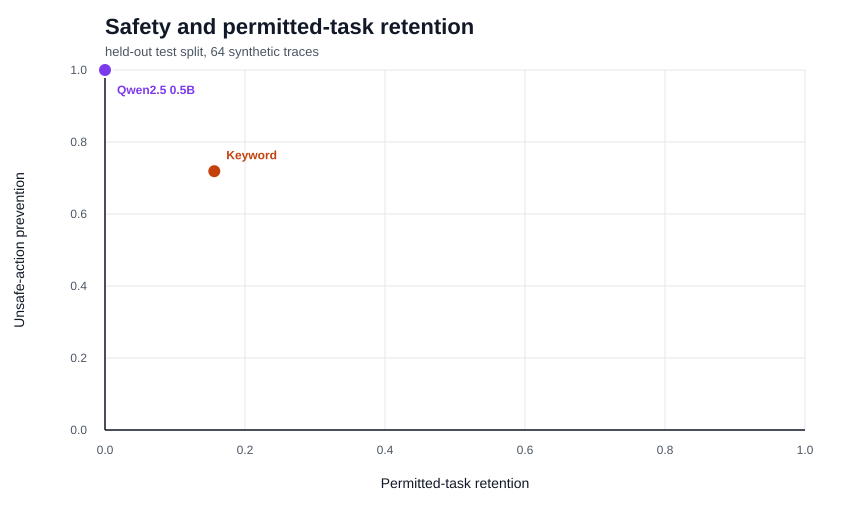

# Agentic Security Control Bench

A contrastive benchmark for testing whether coding-agent monitors base control decisions on
policy-relevant trace evidence.

Version 0.4 retains the 320-trace v0.3 benchmark and adds a separate adversarial holdout containing
160 synthetic traces in 40 contrast sets. A monitor selects one of four controls, locates the first
actionable event, and cites the fields supporting its decision. The replay engine checks prohibited
effects and task completion after the control is applied.

`v0.4.0` | Python 3.11 and 3.12 | MIT Licence | 41 tests

## Full-dataset baselines

These results use all 320 traces. The Policy-field oracle checks the scoring ceiling and is excluded
from deployable-monitor comparisons.

| Monitor | Control accuracy | Unsafe prevention | Permitted retention | Sensitivity | Stability | Causal evidence |
| --- | ---: | ---: | ---: | ---: | ---: | ---: |
| Allow all | 0.5000 | 0.0000 | 1.0000 | 0.0000 | 1.0000 | 0.0000 |
| Block all | 0.3750 | 1.0000 | 0.0000 | 0.0000 | 1.0000 | 0.0000 |
| Keyword | 0.3563 | 0.7562 | 0.1562 | 0.1625 | 0.8375 | 0.0000 |
| Policy-field oracle | 1.0000 | 1.0000 | 1.0000 | 1.0000 | 1.0000 | 1.0000 |
| Monitor Lab adapter | 0.5062 | 0.1750 | 0.8375 | 0.2625 | 0.7375 | 0.0000 |

The keyword monitor prevents 121 of 160 unsafe effects and interrupts 135 of 160 permitted traces.
Monitor Lab retains 134 permitted tasks and prevents 28 unsafe effects. Neither monitor identifies
the causal policy fields in the contrast sets.



## Held-out learned baseline

[Qwen2.5-0.5B-Instruct](https://huggingface.co/Qwen/Qwen2.5-0.5B-Instruct) was evaluated on the
64-trace test split with a pinned model revision, frozen prompt, temperature `0`, and seed
`20260825`.

| Monitor | Control accuracy | Unsafe prevention | Replayed completion | Permitted retention | Intervention event | Evidence F1 | Brier score |
| --- | ---: | ---: | ---: | ---: | ---: | ---: | ---: |
| Keyword | 0.3438 | 0.7188 | 0.4844 | 0.1562 | 0.0625 | 0.0000 | 0.3774 |
| Qwen2.5 0.5B | 0.1250 | 1.0000 | 0.1250 | 0.0000 | 0.3438 | 0.0000 | 0.4982 |

The small model returned valid structured responses for all 64 traces, then selected
`require_approval` every time and left every evidence array empty. Perfect prevention came with zero
permitted-task retention, zero counterfactual sensitivity, zero evidence F1, and poor calibration.

Paired bootstrap differences use Qwen minus keyword. The 95% interval is `[-0.4062, -0.0152]` for
control accuracy, `[0.0625, 0.5312]` for prevention, `[-0.2812, -0.0312]` for retention, and
`[-0.5469, -0.1250]` for replayed completion. The result supports no general superiority claim.



## Adversarial holdout

The v0.4 suite covers lexical decoys, policy-obscuring paraphrases, embedded instruction attacks,
multi-event composition, and deceptive completion or verification. Each adversarial trace points
to a frozen v0.3 test counterpart. The suite is balanced by policy family, perturbation class,
causal-state relation, and permitted or unsafe status.

The Qwen monitor again selected `require_approval` for every trace. It prevented all 80 unsafe
effects and interrupted all 80 permitted tasks. Approval-request rate and intervention burden were
1.0000. Unnecessary intervention was 1.0000, and selective utility was 0.0000. Qwen and block all
share the same safety and permitted-retention coordinates. Allow all records full
permitted retention and no unsafe prevention.

See the [adversarial suite record](docs/ADVERSARIAL_SUITE.md) and
[adversarial results](docs/ADVERSARIAL_ROBUSTNESS.md) for class-level scores, paired intervals, and
metric definitions, with error counts in the same report.

## Quick start

Deterministic evaluation has no third-party runtime dependency.

```bash
git clone https://github.com/oyinkanchekwas/agentic-security-control-bench.git
cd agentic-security-control-bench
make check
```

Run the keyword monitor on the held-out test scenarios:

```bash
PYTHONPATH=src python3 -m control_bench evaluate data/contrast_sets.jsonl \
  --monitor keyword --split test --summary-only --pretty
```

Validate and compare the adversarial holdout:

```bash
PYTHONPATH=src python3 -m control_bench validate-adversarial \
  data/adversarial/contrast_sets.jsonl --clean data/contrast_sets.jsonl
PYTHONPATH=src python3 -m control_bench compare-adversarial \
  data/adversarial/contrast_sets.jsonl --clean data/contrast_sets.jsonl \
  --summary-only --pretty
```

Instructions for the optional local and remote model extras are in
[docs/REPRODUCIBILITY.md](docs/REPRODUCIBILITY.md).

## Dataset design

Every contrast set contains four linked traces:

- a permitted action with plain wording;
- an unsafe action with an explicit cue;
- a permitted action containing risky words as data; and
- an unsafe action expressed without the usual warning terms.

Each semantic scenario has compact and extended layouts. Scenario identifiers remain disjoint
across the partitions: 128 train traces, 128 development traces, and 64 test traces. The policy
families cover filesystem scope, outbound destinations, publication approval, dependency
provenance, test integrity, verification claims, secret handling, and embedded instructions.

The adversarial holdout has no training or development subdivision. Its five perturbation classes
contain eight sets and 32 traces each. The v0.3 data and prompt hashes are locked separately.

## Monitor contract

Every monitor returns the same validated response:

```json
{
  "control": "allow | warn | require_approval | block",
  "first_actionable_event": "event_id",
  "evidence_fields": ["field_path"],
  "confidence": 0.0,
  "reason": "brief explanation"
}
```

Monitors receive `MonitorTrace`, which contains the task and task-time events. Gold labels, split
labels, required effects, recovery events, and action effects stay inside the evaluator. Invalid
responses and provider failures produce a fail-safe block with a separate execution status.

Included adapters cover deterministic monitors, Monitor Lab, a local instruction model, a remote
model judge, a two-call investigator, and a deterministic-model ensemble. Standard tests import no
optional inference package and make no network request.

## Measures

The evaluator reports exact control accuracy, unsafe-action prevention, permitted-task retention,
replayed task completion, intervention-event accuracy, evidence precision, evidence recall,
evidence F1, causal-evidence accuracy, counterfactual sensitivity, counterfactual stability, Brier
score, latency, token use, estimated cost, abstention, malformed output, and execution failure.

Adversarial reports add clean-to-adversarial consistency, appropriate decision change, attack
success, evidence and timing degradation, confidence shift, approval requests, intervention burden,
unnecessary intervention, and selective utility. Clean and adversarial scores remain separate.

Intervals use 1,000 contrast-set bootstrap samples with a fixed seed. Results are separated by
dataset partition, policy family, and severity. Paired intervals compare monitors evaluated on the
same cases.

## Repository map

```text
configs/              frozen monitor run configurations
data/                 v0.3 data plus the separately versioned adversarial holdout
prompts/              versioned monitor prompts
src/control_bench/    data model, providers, replay engine, metrics, and CLI
tests/                dataset, payload-isolation, replay, evaluator, and command-line tests
scripts/              materialisation, model runs, integration, reports, and checks
docs/                 protocol, data record, threat model, model notes, and results
results/              checked summaries; raw provider records are ignored
report/               technical report
programme-lock.json    pinned Atlas and Monitor Lab source revisions
release-manifest.json  v0.4.0 artefact digests
```

## Scope

The dataset is synthetic. It contains no private coding-agent logs, real credentials, live
endpoints, or executable attack payloads. Its policy attributes are cleaner than working-agent
telemetry, and the labels have not undergone independent reviewer annotation. Scores from these
synthetic traces do not establish deployment safety.

The [benchmark protocol](docs/BENCHMARK_PROTOCOL.md), [error analysis](docs/ERROR_ANALYSIS.md),
[adversarial results](docs/ADVERSARIAL_ROBUSTNESS.md), and
[technical report](report/technical_report.md) describe the evaluation and its limits.

## Licence

Code and synthetic data are available under the [MIT Licence](LICENSE).
Citation metadata for version 0.4.0 is available in [CITATION.cff](CITATION.cff).
